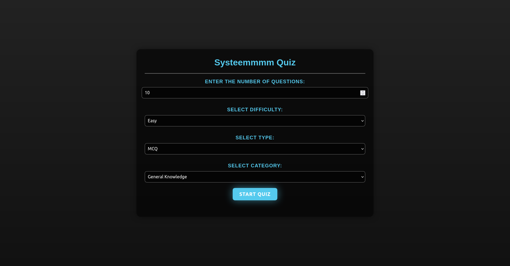
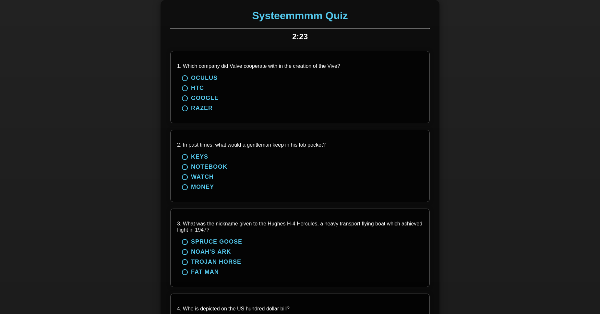

# Systeemmmm Quiz - Frontend Web Application




Welcome to Systeemmmm Quiz, a frontend web application for conducting quizzes. This application is designed using HTML, CSS, and JavaScript.

## Getting Started

### Prerequisites
To run this application, you'll need a web browser like Chrome, Firefox, or Edge.

### Installation
1. Clone the repository:
   ```sh
   git clone https://github.com/akshitkamboz13/systemQuiz.git
   ```
2. Navigate to the project directory:
   ```sh
   cd systemQuiz
   ```
3. Open `index.html` in your web browser to access the application.

## Usage
1. Open the web application in your browser.
2. Navigate through the interface to access quizzes.
3. Answer quiz questions and submit your responses.
4. View your quiz results at the end.

## Features
- User-friendly interface for quiz participation.
- Interactive quiz questions with multiple-choice options and ture-false.
- Immediate feedback on submitted quiz answers.
- Clear display of quiz scores and results.

## Contributing
Contributions are welcome! Here's how you can get involved:
1. Fork the repository.
2. Create a new branch for your feature/bugfix.
3. Make your changes and test them thoroughly.
4. Commit your changes with descriptive commit messages.
5. Push your changes to your forked repository.
6. Create a pull request to the `main` branch of this repository.

## License
This project is licensed under the MIT License.

Feel free to contact us at akshitkamboz13@gmail.com for any questions or feedback. We hope you enjoy using Systeemmmm Quiz!
